# BharatLaw AI - System Architecture

## 🏗️ High-Level Architecture

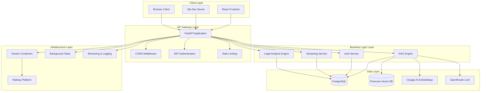

## 🔧 Component Architecture

### Backend Components

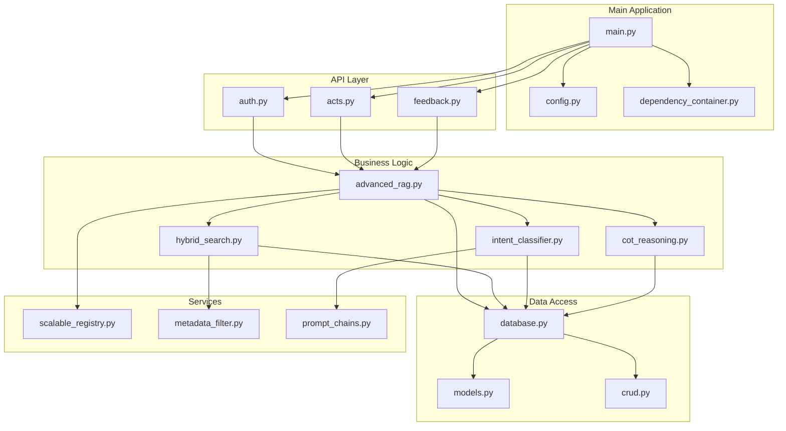

### Frontend Components

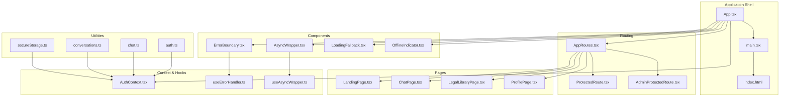

## 📊 Data Flow Architecture

### Authentication Flow

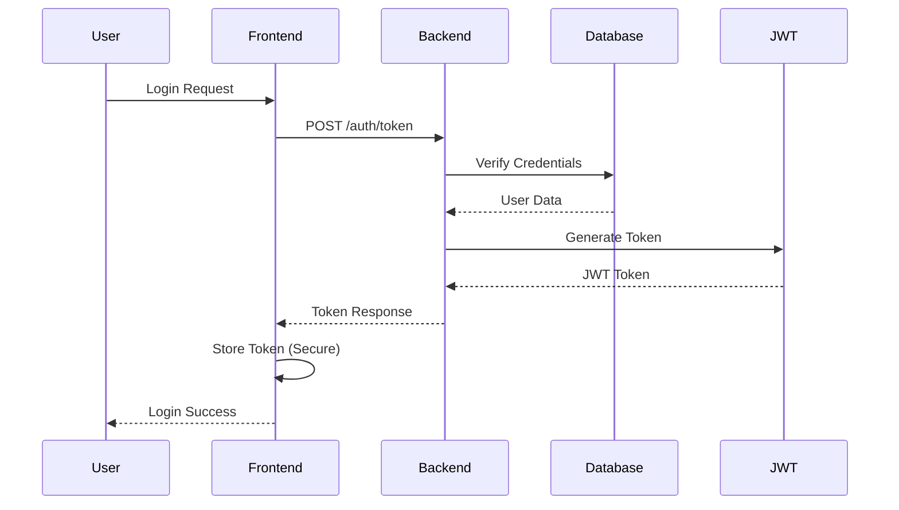

### RAG Query Flow

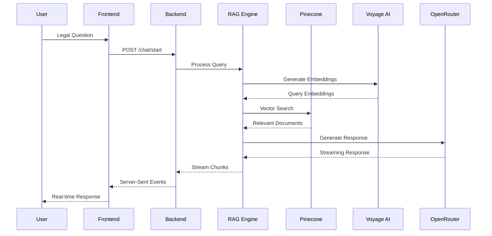

### Streaming Architecture

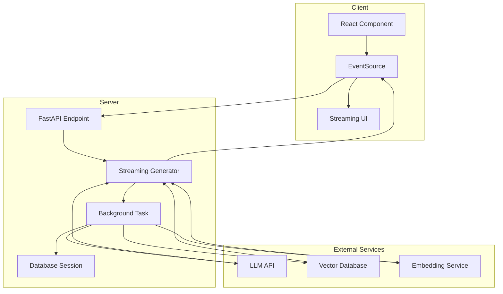

## 🔄 State Management Architecture

### Backend State Management

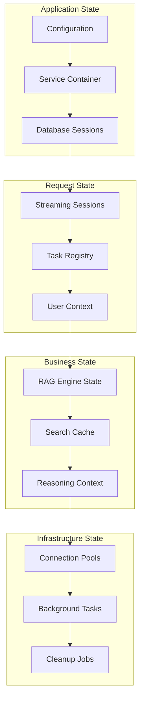

### Frontend State Management

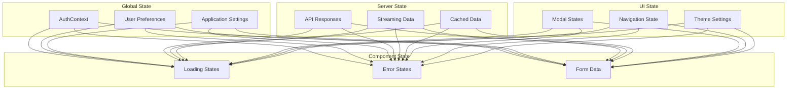

## 🗄️ Database Schema

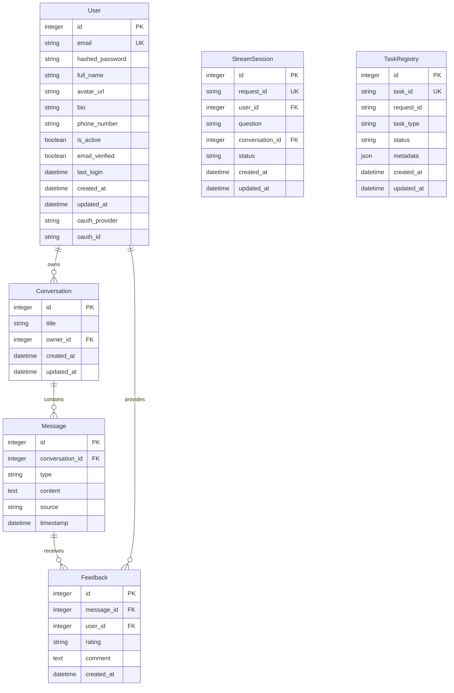

## 🔐 Security Architecture

### Authentication Flow

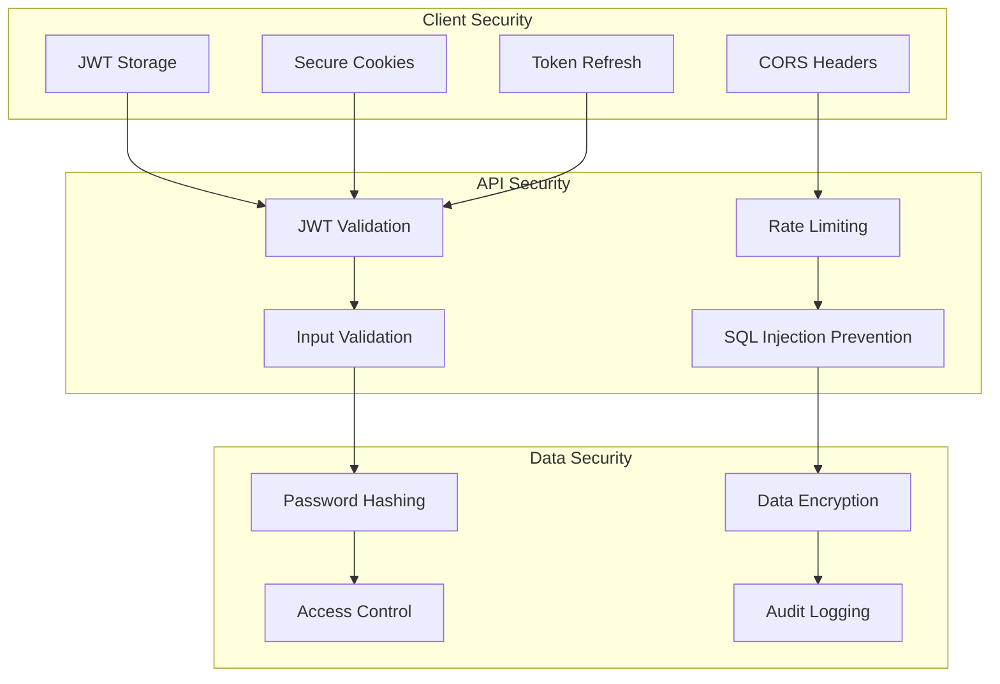

## 📈 Performance Architecture

### Caching Strategy

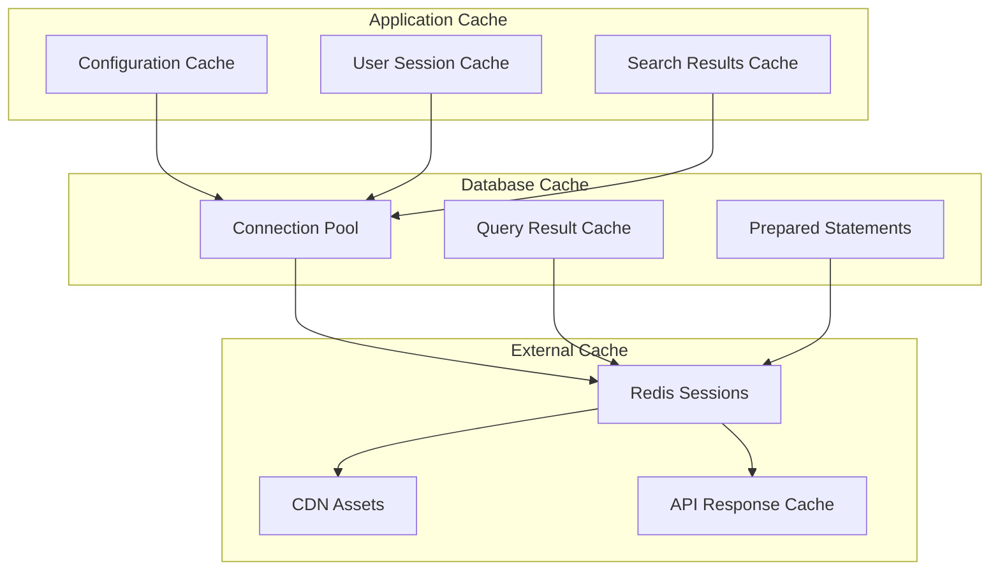

### Monitoring Architecture

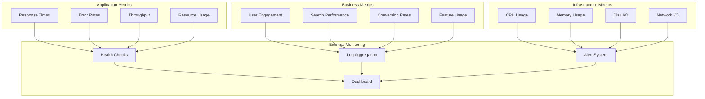

## 🚀 Deployment Architecture

### Railway Deployment

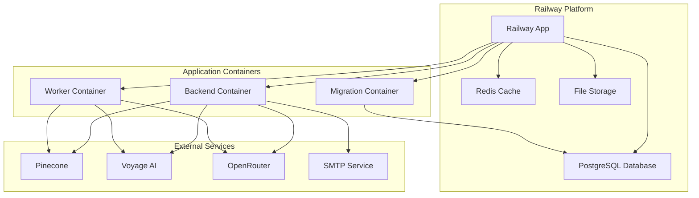

### Vercel Deployment (Frontend)

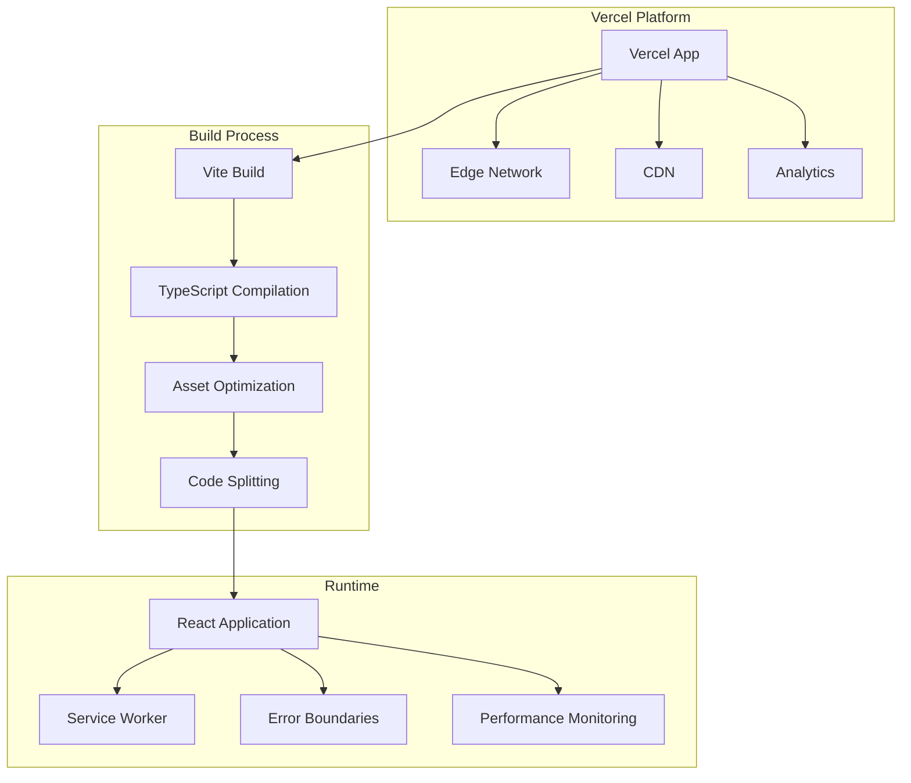

## 🔧 Development Workflow

### Local Development

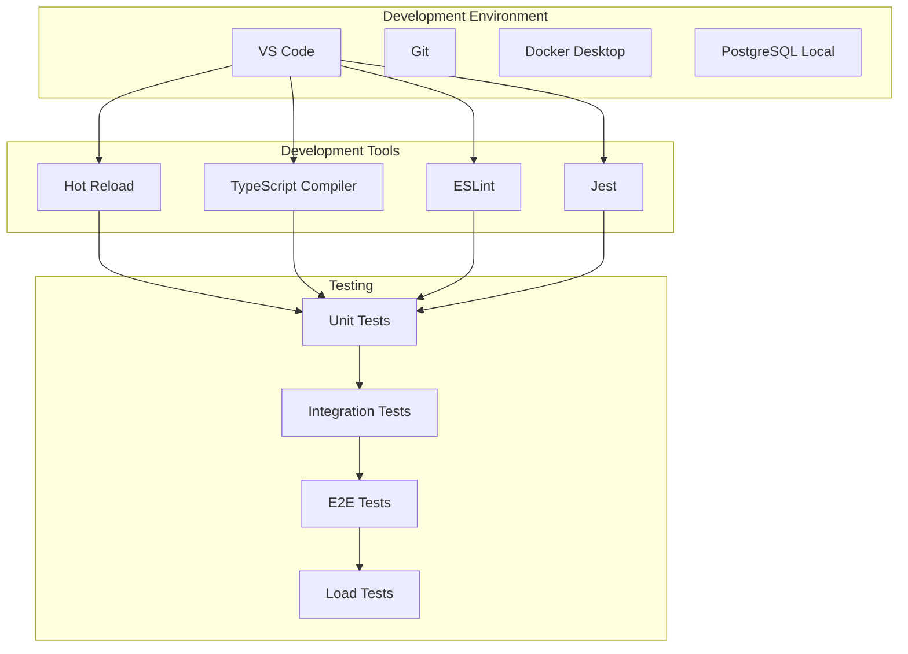

### CI/CD Pipeline

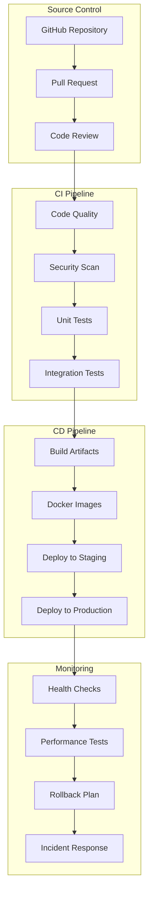

This architecture documentation provides a comprehensive view of the BharatLaw AI system's design, components, data flows, and deployment patterns. The modular architecture ensures scalability, maintainability, and robust performance for legal document analysis and AI-powered assistance.